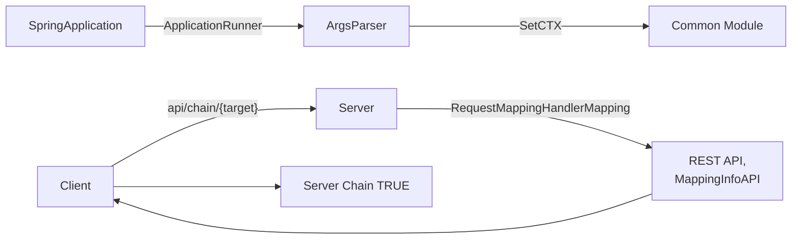
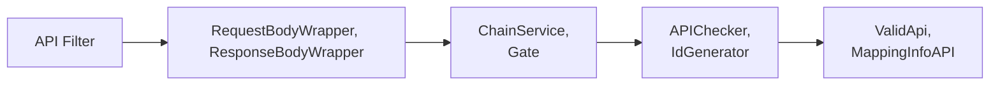
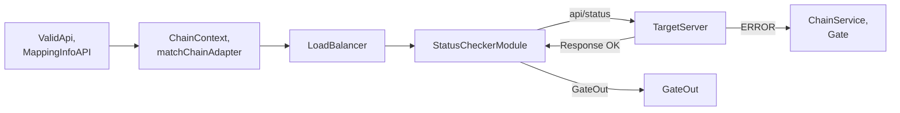
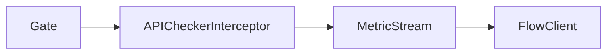
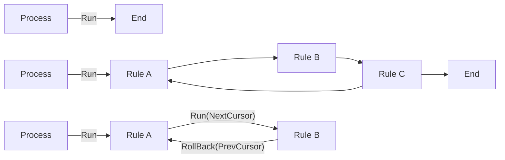
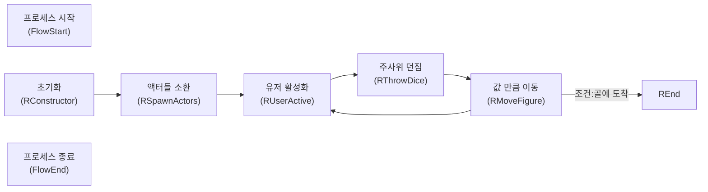
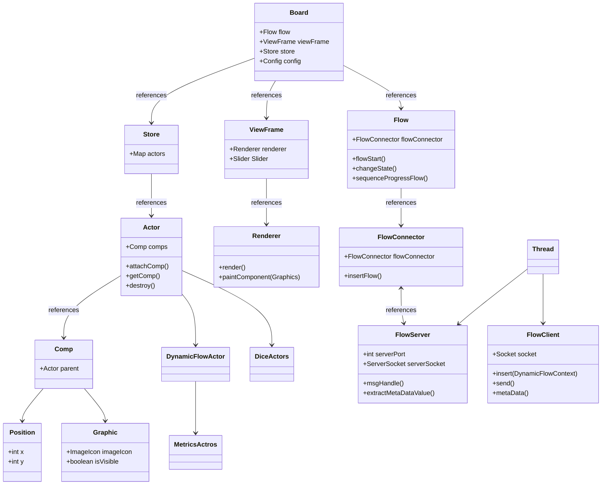

# 테트라포드


## 📝 프로젝트 개요
### CommonModule
마이크로 서비스라는 접근에 책임 및 역할을 모듈에 위임하여,
서비스 서버 간의 비즈니스 로직의 높은 결합성을 느슨한 결합으로 시도해보았습니다.
API요청을 통해 대상 서버와 체인을 연결하고 적합한 데이터 유형 체크 및
체인 어뎁터 분기, 로드밸런싱, 서버 상태 체크, 전역적 ID생성기 등의
Gradle Java Spring Boot프로젝트 내의 공통 모듈로서 제작해보았습니다.

### Metrics
Spring 공부 중 추상적 설계에 대해 알게 되었고,
추상화된 프로세스를 진행하는 플로우라는 구조를 통해 로직이 메인 루프가 아닌,
사용자가 확장한 코드 덩어리를 원하는 순서에 집어넣어 유연성을 확보한 Java Swing 프로젝트입니다.
프로세스 흐름을 사용자가 조작하기에 이전 행위로 되돌아가거나, 다시 복구할 수 있는 틀을 가지고 있으며,
그 틀 안에 사용자가 정의된 코드 덩어리를 유연하게 집어넣어보았습니다.
멀티 플레이어가 주사위를 던져 목적지에 도달하는 동기화 시뮬레이션 혹은
Http 요청, 응답을 추적 시각화할 수 있는 프로그램으로서 확장해보았습니다.

### Flow
플로우라는 구조를 통해 로직이 메인 루프가 아닌, 사용자가 확장한
코드 덩어리 (RULE) 를 원하는 순서에 집어넣어 조작합니다.
프로세스 플로우 기반, 가상 커서가 옮겨 다니며
해당 위치의 프로세스 롤백 혹은 복원 처리

## 🧩 프로젝트 초기 의도 및 방향변경
### CommonModule
- 초기에는 대용량 분산 처리라는 키워드를 기반으로 시도된 프로젝트였습니다.
- 로드밸런서는 API 서버를 분산하여 호출하고, API 서버는 DB 서버에 샤딩을 적용하고자 하였습니다.
- 그러나 프로젝트 진행 중, 로드밸런서는 어떤 API 서버를 호출해야 하는지 알고 있어야 했고, API 서버는 어떤 DB 서버에
샤딩을 적용해야 하는지 알고 있어야 했습니다. 그로 인해 개발 중 서버를 역순(즉, DB, API, LoadBalancer)으로
작동시키거나 끄는 일이 빈번하게 발생했습니다. 이러한 경직된 구조에 의문을 느끼게 되었고, 결국 구조 개선을 위해
**Common Module** 개발로 방향을 전환하게 되었습니다.

## 🛠️ 사용 기술
- 기술
  - JAVA
  - JAVASCRIPT
  - SPRING
  
## 🚀 Common Module 전체 흐름

<br><br>

<br><br>

<br><br>

<br><br>

<br><br>

<br><br>

<br><br>

<br><br>

<br><br>

<br><br>


## 🔍 공통모듈 살펴보기
### 공통모듈 시연
<br><br>
- KR API, DB서버 추가후 서로 통신하는 모습입니다.
- 이후 KR DB서버를 추가 연동한 후 통신
- 글로벌 서버 및 EN API, DB서버를 추가
- 어댑터를 통해 HTTP 헤더를 비교
로컬라이징을 통해 어댑터로 분기하는 모습입니다.
<br><br>

<br><br>
- 포스트맨으로 요청하여 어댑터 분기 및
- KR DB 서버로 밸런싱되는 모습입니다.
<br><br>

<br><br>
- 가상 커서를 통해 프로세스를 되감거나 복구합니다.
Undo, redo기능을 활용하여 요청 응답을 추적합니다.
Metrics(Flow 프로젝트 베이스)의 기능.
<br><br>

<br><br>
- 어댑터를 통해 HTTP헤더를 비교하여, KR, EN이 분기되는 모습입니다.
<br><br>

<br><br>
- KR DB서버가 런타임 중 확장, 연결되는 모습입니다.
<br><br>

### 메트릭스 & 플로우 시연
<br><br>
- 추상화된 룰이라는 블럭 코드들이 실행되는 모습입니다.
유저의 활성화, 주사위 굴림, 이동, 종료등의 프로세스가
시뮬레이션 되는 모습입니다.
<br><br>

<br><br>
- 호스트 기준 다수의 클라이언트가
동기화되는 모습입니다.
Winter 서버를 이용하여 상태를 동기화 합니다.
<br><br>

## 🏗️ 플로우 구현 컨텐츠

### Metrics
<br><br>
<br><br>
- Common Module 프로젝트 중 확장한 Metrics입니다.
서비스 환경 내에서 발생하는 클라이언트 및, 런타임 중 활성화 되는 서버 그리고
각 서비스간의 HTTP 통신의 요청 과 응답을 추적하여 화면에 그려냅니다.

### Dice
<br><br>
<br><br>
<br><br>

- 4개의 플레이어가 주사위를 돌려 목표에 도달하는 프로세스를 가진 FLOW입니다.
또한 Winter 서버를 사용하여 동기화를 구현해보았습니다.
1. a. [ 다음 사용자 활성화 ] > b. [ 주사위 던짐 ] > c. [ 사용자 이동 ] > <br>
d. [ 골에 도착했는지 체크 : 아니라면 ] > f. [ a. 로 다시 이동 ] <br>
d. [ 골에 도착했는지 체크 : 적합하다면 ] > g. [ 프로그램 종료 ] <br>
같은 룰 (코드 덩어리 ) 을 정의하고, 프로세스를 조작하여 시뮬레이션을 진행 합니다.

2. 만약 기획 의도가 [ 주사위를 던지고 이동하기 전에 더블 주사위를 체크해라 ]로 변경 되어도 <br>
b. [ 주사위 던짐 ] > b2. [ 더블 주사위 체크 ] > c. [ 사용자 이동 ] <br>
더블 주사위 체크 룰을 생성하고, 프로세스를 삽입함으로써 손쉽게 구조를 조작할 수 있습니다.

## 📋 플로우 구현 기능 
### 공통기능
- 가상 커서 : Undo, Redo : 롤백 및 원 상태로 되돌려 이전 프로세스 혹은 현 상태로 다시 복구 합니다.
- 현재 상태 추적 및 로깅
- 렌더링: 해당 객체의 포지션 컴포넌트 및 그래픽 컴포넌트를 통해 Swing JPanel의 페인트로서 그려냅니다.
  - 레이어: 리소스를 순서대로 그려내어 우선순위를 설정할 수 있습니다.
### Metrics
- 클라이언트 & 서버 활성화, 트래픽 추가, 트래픽 패스 드로우 ( 연결 점 그리기)
- 소켓 : Spring Boot로 부터 메시지가 도착하여 서버 활성화 및 트래픽 추적을 그려냅니다.

### Dice
- 유저 활성화, 주사위 던짐, 플레이어 이동, 골 체크, 주사위 패스 드로우 ( 경로 그리기 )
- 호스트 기준 다수 클라이언트 Winter 서버와 동기화

## 📝 공통 모듈 다이어그램
### 프로세스 플로우
- 어플리케이션이 실행 될 때 jar로 받은 실행 인자들을 ArgsParser로 파싱하여 공통 모듈 설정을 정의합니다.
- 클라이언트는 API /chain/{target} 호출을 통해 대상 서버의 REST API 엔드포인트들을 동적으로 조회하고,
- 대상 서버는 RequestMappingHandlerMapping을 통해 반환 타입 및 메타 데이터를
MappingInfoAPI 객체로서 클라이언트에게 반환합니다.
- 반환된 메타데이터를 통해 클라이언트는 대상 서버의 API들을 확인할 수 있게 되며 이후 서버 체인 상태로 변환 합니다.



- 클라이언트는 이후 APIFilter를 통해 /api path제외 요청들을 RequestBodyWrapper
ResponseBodyWrapper로서 바디 데이터 스트림을 감싸며
- 이후 필터를 넘어간 요청은 ServerChainService를 통해 게이트로 진입
- 게이트로 진입된 요청은 APIChecker를 통해 IdGenerator를 통해 ID를 부여받습니다.
`(None, Sequence, SnowFlake 기존 아이디 계승, 값 증가, 스노우 플레이크 등)`
- 해당 요청이 유효한 요청 및 데이터인지 ValidApi메소드 MappingInfoAPI 객체와 비교합니다.



- 적합하다면 API /chain/{target} 요청시 설정된 ChainContext를 통해 체인 어댑터들을 확인하고,
`(HTTP Header Language 언어 비교 등)`
- 로드 밸런싱 모듈에 진입 BalancingContext에 의거 설정된 밸런싱으로 분기합니다.
`(Random, Roundrobin, Sharding 랜덤, 순차적, 키 값에 매칭 등)`
- 이후 대상 서버의 API /status 를 요청 서버가 정상적인 상태가 아니라면 다시 게이트로 진입하고,
- 유효한 서버라면 정상적으로 게이트를 나가게 됩니다.
  


- 스프링내의 인터셉터를 통해 공통 모듈을 의존하는 서버들은,
- 요청 및 응답이 MetricStream으로 향하게 되고
- FlowClient를 통해 Metric에 의한 요청 및 응답을 추적합니다.



## 📝 플로우 & 메트릭스 다이어그램
### 프로세스 플로우
- 프로세스가 진행됩니다.
- 추상회된 Rule을 상속받아 코드 덩어리 구현합니다.
- 원하는 위치에 Rule을 집어넣거나, 프로세스 진행 방향을 가로채 제어 변경하기도 합니다.
- 커서를 통해 진행도를 롤백하거나, 다시 진행할 수 있습니다.



### 메트릭스 플로우
- 초기화가 진행되며 FlowClient를 통해 UniqueDynamicFlowContext의 메타데이터 메시지를 파악합니다.
- InsertComputer시 서버가 등장합니다.
- InsertTraffic시 컴퓨터와 컴퓨터 간의 트래픽 선을 연결합니다.

### 다이스 플로우
- 초기화가 진행되며,
- 액터들을 월드에 소환 합니다.
- 유저를 활성화 하고
- 활성화된 유저 기반 주사위를 던지며,
- 유저를 이동 시킵니다.
- 만약 골에 도착했다면 REnd Rule로 이동 하고 그렇지 않다면, RUserActive Rule로 이하 반복 합니다



### 클래스 구조



#### ViewFrame
- JavaSwing JFrame을 상속받았으며 프레임을 담당하며,
Renderer, Slider, ScrollBox등의 클래스를 관리하는 매니저 클래스 입니다.

#### Renderer
- 스토어의 Actor들을 순회하며 대상의 위치 및 그래픽 리소스를,
Swing의 Repaint를 통해 화면을 그려내는 클래스 입니다.
  - actorDraw
  - 해당 Actor의 Position 및 Graphic 컴포넌트를 통해
    객체의 위치 기반 피봇 및 정의 등을 기준으로 다수의 리소스를 그려냅니다.
    ```java
    @Override
    public void paintComponent(Graphics g) {
        super.paintComponent(g);
        if(!isRender) return;
  
        List actors = store.getActors();
        for(Actor it : actors){
            actorDraw(it, g);
        }
        .
        .
        
    }
  
    private void actorDraw(Actor actor, Graphics g){
        Position pos = actor.getComp("Position");
        ArrayList gps = actor.getComps("Graphic");
        if(pos == null || gps == null) return;
  
        gps.forEach( gp ->{
            if(gp.isVisible()){
                int[] sXY = getActorRenderScreenXY(pos, gp);
                resourceDraw(g, gp, sXY[0], sXY[1]);
            }
        });
    }
    ```
  
#### Actor
- 월드상 표현되는 객체 입니다. 컴포넌트를 부착하는 확장성을 지닙니다.
  - Actor::Paper(DiceActor)
  - Actor를 확장한 PaperActor입니다.
    Position, Graphic 컴포넌트를 추가 하여,
    월드 상에 랜더링 될 위치 및 리소스, 레이어를 정의 합니다.
    종이 이미지 리소스가 백그라운드에 그려집니다.
    ```java
    public class Paper extends Actor {

    public Paper() {
        attachComp(Position.class);
        attachComp(Graphic.class)
                .setLayer(BoardConfig.ELayer.BACK)
                .setImage("paper.png")
                .setSize(400, 520);
      }
  }
  ```

#### Comp
- Actor에 부착되어 확장 기능을 담당하는 클래스 입니다.
  - Comp::Graphic
  - Actor에 부착되는 Graphic 컴포넌트 입니다.
    리소스 및 리소스 사이즈와, 피봇을 정의하며
    랜더링 될 순서를 판단하는 Layer 프로퍼티 또한 존재합니다.
    ```java
    public class Graphic extends Comp {
  
          private boolean isVisible = true;
          private ImageIcon image;
          .
          .
  
          public Graphic setLayer(BoardConfig.ELayer layer){
              Actor parent = getParent();
              parent.setActorLayer( layer.getValue() );
              return this;
          }
      
          public Graphic setImage(String src){
              image = new ImageIcon( Util.getResourcePath(src) );
              width = image.getIconWidth();
              height = image.getIconHeight();
              pivotX = 0;
              pivotY = 0;
              return this;
          }
          .
          .
          .
      }
    ```
    
#### Rule
- 프로세스를 진행 할 Rule 입니다.
사용자는 run()메소드로 부터 실행 될 코드 덩어리를 구현하고 프로세스화 합니다.
또한 RuleProperty 통하여 다음 프로세스를 조작 합니다.
탬플릿 메소드 패턴을 통한 Prev, Close Logging을
인터페이스로 손 쉽게 추가하거나 제거 할 수 있습니다.
  - RConstructor
  - Dice의 시작을 알리는 Rule입니다. run 실행시 아무것도 하지 않으나,
    다음 프로세스 방향을 "RSpawnActors" Rule로 향하게 합니다.
    ```java
    public class RConstructor extends Rule implements RulRunLogger {
    
        @Override
        protected RuleProperty ruleProperty() {
            return new RuleProperty()
                .setNextRule("RSpawnActors");
        }
    
        @Override
        public void run() {
        }
    
        @Override
        public void runPrevLog() {
        }
    
        @Override
        public void runCloseLog() {
            sb.appendText(getCurFlow(), "1. 초기화 성공");
        }
    }
    ```
    
  - RMoveFigure
  - 다음 프로세스 연결을 "RUserActive"로 향하게 합니다.
    run가동시 주사위 값 만큼 노드로 이동 하며,
    rollback시 이전 상태 만큼 복구합니다.
    결과 골체크에 성공했다면 다음 연결을 "REnd"로 전환 합니다.
    ```java
    public class RMoveFigure extends Rule 
      implements RuleRollback, RulRunLogger, RuleRollbackLogger {

      protected RuleProperty ruleProperty;
      protected BoardConfig boardConfig;
  
      @Override
      protected RuleProperty ruleProperty() {
          boardConfig = (BoardConfig) bc;
          ruleProperty = new RuleProperty()
                  .setNextRule("RUserActive");
          return ruleProperty;
      }
  
      @Override
      public void run() {
          Node node = store.getMainNode();
          FlowStatus flowStatus = getCurFlow();
          Figure figure = store.getActiveFigure(flowStatus);
          node.next(figure, flowStatus);
          if ( node.isGoalCheck(figure, boardConfig.goal) ){
              ruleProperty.setNextRule("REnd");
          }
  
      }
  
      @Override
      public void rollback() {
          Node node = store.getMainNode();
          FlowStatus flowStatus = getCurFlow();
          FlowStatus prevFindStatus = getCalcFlow(-1);
          Figure figure = store.getActiveFigure(flowStatus);
          
          node.prev(figure, flowStatus, prevFindStatus);
          ruleProperty.setNextRule("RUserActive");
      }
    ```

  - REnd
  - "REnd"는 다음 체인 연결이 없으므로 프로세스가 종료 됩니다.
    ```java
    public class REnd extends Rule 
      implements RuleRollback, RulRunLogger, RuleRollbackLogger {

      protected BoardConfig boardConfig;
  
      @Override
      protected RuleProperty ruleProperty() {
          boardConfig = (BoardConfig)bc;
          return new RuleProperty();
      }
  
      @Override
      public void run() {
          FlowStatus fs = getCurFlow();
          Victory victory = store.getFirstActor(BoardConfig.ELayer.FIGURE_FRONT, Victory.class);
          victory.getPosition().setPosition(6, 4);
          victory.visible(true);
          victory.toText(fs.getActiveUserIndex(), boardConfig.goal, fs.getSequence());
      }
  
      @Override
      public void rollback() {
          Victory victory = store.getFirstActor(BoardConfig.ELayer.FIGURE_FRONT, Victory.class);
          victory.visible(false);
      }
    ```
    
#### Flow
- 프로세스를 진행하는 클래스 입니다. 프로세스 진행시 시퀀스 커서가 증가합니다.
시퀀스 커서 기반 가상 커서를 이전 이후로 변경하며, 상태를 롤백 할 수 있습니다.
  - sequenceProgressFlow
  - 해당 룰로 상태를 변경 하며, 시퀀스 프로세스를 증가 시킵니다.
    진행될 프로세스는 이전의 상태값(FlowStatus)을 계승합니다.
    wrapRunLogger를 통해 해당 룰의 프로세스를 진행 시키며,
    현재 룰에 체이닝된 다음 룰을 실행하며 이하 반복합니다.
    ```java
    private void changeState(String ruleType){
        Rule rule = getRule(ruleType);
        boolean isSameCursor = (flowSequence == virtualCursor);
        boolean isFlowSequenceProcessing = ( flowSequence == statusStore.size() - 1);
        if( isSameCursor && isFlowSequenceProcessing){
            sequenceProgressFlow(rule);
        }
    }
        
    private void sequenceProgressFlow(Rule rule){
        ++flowSequence;
        ++virtualCursor;

        String ruleName = rule.getClass().getSimpleName();
        FlowStatus flowStatus = new FlowStatus(flowSequence, ruleName);
        FlowStatus prevStatus = hasPrevFlowStatus() ? getCalcFlow(-1) : null;
        if(prevStatus != null)
            flowStatus.duplicateWithoutUniqueFields(prevStatus);
        statusStore.add( flowStatus );

        RuleProperty property = rule.getRuleProperty();
        OnSequenceFlowStatusHandle onSequenceFlowStatusHandle = flowConnector.getOnSequenceFlowStatusHandle();
        if(onSequenceFlowStatusHandle != null){
            onSequenceFlowStatusHandle.apply(rule, flowStatus);
        }

        wrapRunLogger(rule);
        String next = property.getNextRule();
        if(next != null && !next.isEmpty()){
            changeState(next);
        }
    }
    ```
                      
  - wrapRunLogger
  - 템플릿 메소드 패턴을 통해 사용자는 logger 인터페이스를 통해
    run 실행 전 후 로깅을 손 쉽게 추적할 수 있습니다.
    ```java
    private void wrapRunLogger(Rule rule){
        if(rule instanceof RulRunLogger){
            ((RulRunLogger)rule).runPrevLog();
        }
        rule.run();
        if(rule instanceof RulRunLogger){
            ((RulRunLogger)rule).runCloseLog();
        }
    }
    ```

## 📊 공통 모듈 프로젝트 회고
### 결과
- 포스트맨을 통한 클라이언트 요청 및 응답을 Metrics를 통해 바라본 모습입니다.
결합 처리 등의 책임, 역할을 모듈에 위임하여 서버간의 느슨한 의존성, 서버의 독립적으로 존재,
하나의 서비스가 유효하지 않아도 전체 서비스 망가짐을 최소화 해보았습니다.

### 의도하였던 점
- 스웨거를 통해 대상 서버의 API를 확인 할 수 있었으나, 핸들러 메소드 매핑, 자바 리플랙션으로 직접 구현해보았습니다.

### 문제 발생 및 해결
- 로직 중 바디 데이터를 다수 읽어야 했던 상황이 있었습니다. 당시에는 @RequestBody 또는 바디 데이터 스트림을
소비하는 방식에 대해 잘 몰랐고, 어느 로직에서든 스트림을 한 번 읽으면 이후에는 바디 데이터를 다시 읽을 수
없었지만, 필터의 RequestBodyWrapper를 통해 스트림 데이터를 감싸 해결하였습니다.
- Common Module의 Metrics Stream을 사용하여 메시지를 보내고 이를 Metrics(Flow)로 시각화하는 과정에서 문제가 발생한
적이 있었습니다. 스프링의 요청 및 응답 발생 시 인터셉터를 통해 addRequest메소드를 호출하고, Metrics Stream은
연결된 FlowClient 소켓으로 메시지를 전송하여 시각화가 이루어졌습니다. 하지만 몇몇 메시지가 FlowClient에
정상적으로 도달하지 못하는 문제가 있었습니다.
이를 단순히 요청 및 응답에 맞춰 addRequest를 호출하는 방식이 아닌, 멀티쓰레드 환경에 맞춰 메시지 큐를 사용하도록
변경하고, FlowClient의 생명 주기 시작을 Application Runner의 시작 시점에 함수형 인터페이스로 활성화하였습니다.
이후, FlowClient는 변경된 방식 덕분에 모든 메시지를 정상적으로 수신할 수 있게 되었습니다.
짧은 견해로 문제를 보았을 때, 람다로 지역성이 캡쳐링 되어 MetricStream 가동 영역에서 유효한 CPU 컨텍스트내의
코드프로세스를 끝낼 수 있었다 생각합니다 . addRequest와 같은 메소드 형태는 실제로 스택에 올라가 처리가 되어,
사용자에게 명시적으로 호출 되었으나, 컨텍스트 스위칭이 발생 즉, 다른 스레드로 변경되면서 FlowClient와 연결되는
TCP 버퍼 스트림이 중간에 해제 되어, FlowClient에 정상적인 도달이 불가했다 추론합니다.

### 아쉬운 점
- 서버 체인 서비스 로직을 필터와 인터셉터 영역으로 모두 추상화하고 싶었던 부분입니다. 즉, 필터와 인터셉터를 통해
컨트롤러에서 반환되는 response를 체인 여부에 따라 조작하려고 했으나, postHandle이나 doFilter 이후에는 이미
커밋된 데이터(response)를 조작할 수 없었습니다. response.isCommitted() 메서드로 커밋 여부를 확인할 수
있었지만, 그 시점은 데이터를 조작하기에 적합한 위치가 아니었습니다. 결국, 체인 서비스 로직을 컨트롤러에서 직접
처리해야 했습니다.

### 웹 플럭스와, 가상 스레드
- 프로젝트를 진행하는 중 자바 19의 프로젝트 Loom을 통해 운영체제의 커널 스레드(플랫폼 스레드) 위에 경량화된 가상
스레드를 실행할 수 있다는 점을 알게 되었습니다 . Spring과 Tomcat처럼 한 개의 요청에 하나의 스레드를 할당하는
기존의 동시성 문제를 해결하기 위해 WebFlux 개념이 도입되었지만 , 가상 스레드를 사용하면 WebFlux의 대체제가 될 수
있지 않을까 하는 생각도 들었습니다. 그러나 대부분의 의견은 가상 스레드가 WebFlux의 대체제가 아니라 보완적인
역할을 할 것이라는 쪽이었습니다. 이로 인해 WebFlux만이 해결할 수 있는 고유한 문제들에 대해 더욱 흥미를 느끼게
되었습니다.
- WebFlux의 러닝 커브를 극복하는 것이 쉽지 않겠지만, 언젠가는 다양한 리액티브 오퍼레이터 체인을 원활하게 다룰 수
있는 능력을 기르고자 하는 열망이 생긴 프로젝트라고 생각합니다.

### 부족한 JPA 숙련도
- 같은 기수와 시간이 지난 다른 기수의 포트폴리오 발표를 보게 되었고, 그들도 JPA의 양방향 매핑에서 문제가 발생한
경험이 있었습니다. 저 또한 양방향 순환 관계로 인한 문제를 고민해본 적이 있었으나, 서로의 문제 해결이 달랐습니다.
- 그들은 문제를 해결하기 위해 단방향 매핑으로 전환하여 순환 참조 문제에서 벗어났지만 , 저는 오히려 양방향 매핑을
고수하였습니다.
- 저는 JPA의 사용 목적이 단순히 관계형 데이터베이스의 매핑을 넘어, 객체 지향적인 관점에서 객체 간의 관계를
자연스럽게 다루는 방식이라고 생각하고 있었습니다. 이에 따라, 단방향 관계는 오히려 어플리케이션의 복잡성을
증가시킬 수 있다는 우려를 가졌습니다.
- 특히, 객체가 데이터를 가지고 있거나 없거나 하는 단방향 관계에서는 연결되지 않은 객체를 찾아가야 하는 작업이
필요하게 되는데, 이는 JPA의 사용 흐름에 적합하지 않을 수 있다고 느꼈습니다.
- 그와 동시에, 순환 관계에서 발생하는 문제는 사실 JSON 직렬화 과정에서 발생한다는 것을 깨달았습니다. 그래서 저는
컨트롤러 단에서 DTO를 사용하여 의도적으로 순환 관계를 끊어주기로 했습니다. DTO는 인/아웃 데이터를 처리하는
용도로 사용되어, 순환 참조를 방지하고, 애플리케이션 내부에서는 엔티티를 통해 양방향 관계가 유지될 수 있도록
했습니다.
- 이와 같은 접근 방식은 JPA에서의 양방향 매핑을 고수하면서도 순환 참조 문제를 해결하는 방법이었지만 , JPA에 대한
숙련도가 낮아 이 선택에 대한 명확한 근거를 찾지 못해 부족함을 느꼈습니다.

## 📊 플로우 & 메트릭스 프로젝트 회고
### 좋았던 점
- 사용자가 빈 껍데기에 (Actor) 기능을 가진 컴포넌트 (Comp)를 부착해 기능을 확장하여 디자인 할 수 있는 설계는
다수의 콘텐츠을 제작하기에 유용하였습니다.
- 프로세스 실행 전, 후의 로그를 손 쉽게 탈부착 하기 위한 인터페이스를 설계하였고 , 사용자는 로그 인터페이스 통해
로그를 프로세스 전 후로 남길 수 있게되었습니다. 이는 스프링의 AOP, Before, After 어드바이스 프록시 구조에 대해
생각해볼 계기가 되었습니다.
- **Common Module** 프로젝트 중 필요했던 HTTP 메시지의 요청 응답 추적 시각화를 Flow 프로젝트 기반 손쉽게 구현 할
수 있었습니다.

### 아쉬운 점
- 프로세스를 실행하는 메소드가, 프로세스를 호출하는 구조로 인해 호출 스택이 지속적으로 쌓입니다.
이로 인해 디버깅이 어려워지고 , 충분한 스택 사이즈를 설정해야 합니다.

## 📜 마무리
- 작업 일 : 2024. 08
- 발표 슬라이더 (Common Module) : https://docs.google.com/presentation/d/1-aF2Z8AIoVJXReIrFgvFs0JuYj2NdGVTvfx_jvCfH5A/edit
- 발표 슬라이더 (FLOW): https://docs.google.com/presentation/d/1ZeOPq-6PRY6_joYS3ArO-okQF4NZ23CP/edit#slide=id.p1


