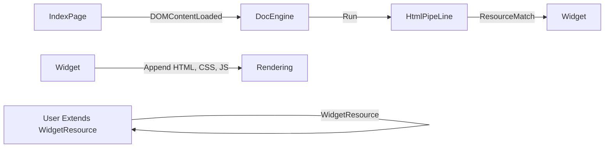
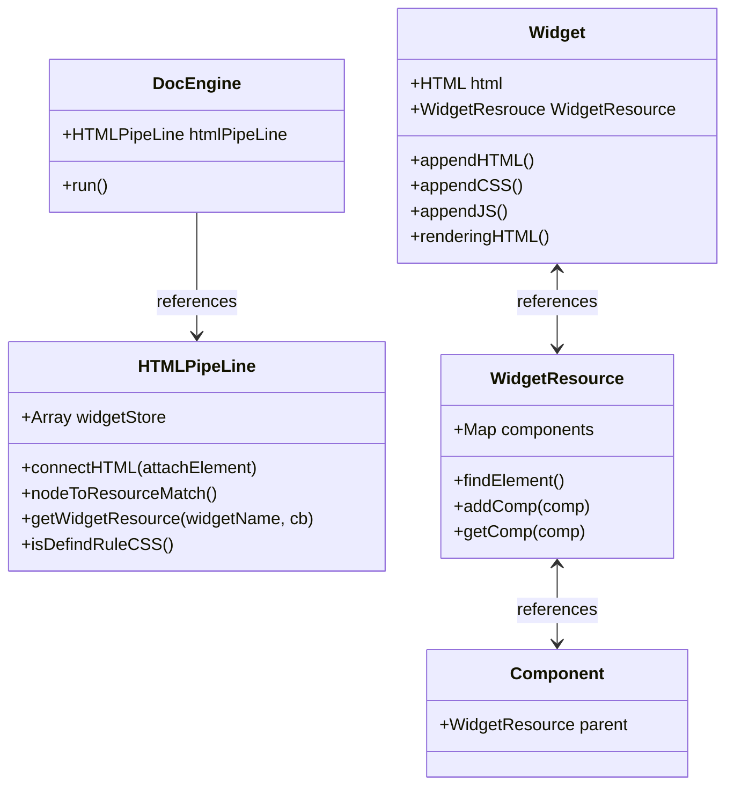
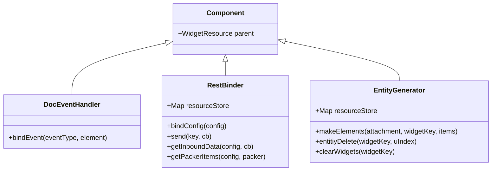
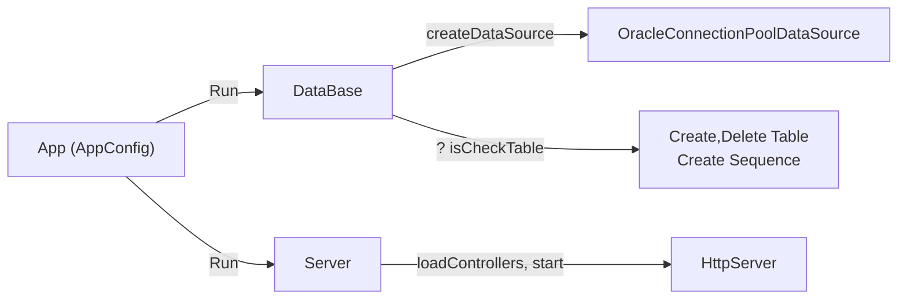
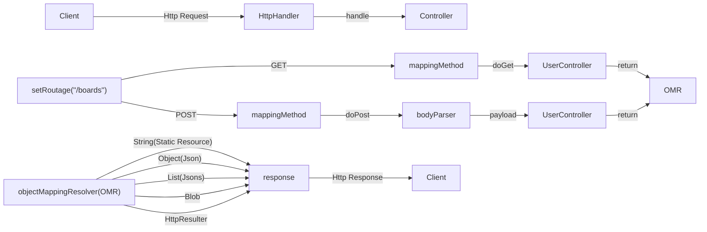
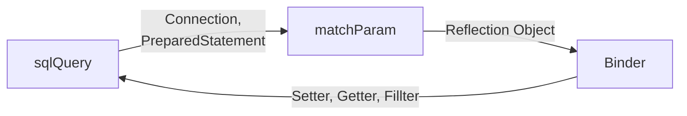
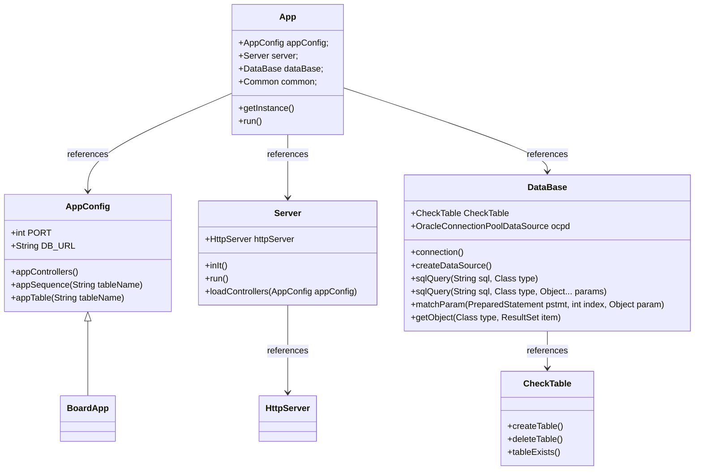

# 테트라포드


## 📝 프로젝트 개요
### CommonModule
마이크로 서비스라는 접근에 책임 및 역할을 모듈에 위임하여,
서비스 서버 간의 비즈니스 로직의 높은 결합성을 느슨한 결합으로 시도해보았습니다.
API요청을 통해 대상 서버와 체인을 연결하고 적합한 데이터 유형 체크 및
체인 어뎁터 분기, 로드밸런싱, 서버 상태 체크, 전역적 ID생성기 등의
Gradle Java Spring Boot프로젝트 내의 공통 모듈로서 제작해보았습니다.

### Metrics
Spring 공부 중 추상적 설계에 대해 알게 되었고,
추상화된 프로세스를 진행하는 플로우라는 구조를 통해 로직이 메인 루프가 아닌,
사용자가 확장한 코드 덩어리를 원하는 순서에 집어넣어 유연성을 확보한 Java Swing 프로젝트입니다.
프로세스 흐름을 사용자가 조작하기에 이전 행위로 되돌아가거나, 다시 복구할 수 있는 틀을 가지고 있으며,
그 틀 안에 사용자가 정의된 코드 덩어리를 유연하게 집어넣어보았습니다.
멀티 플레이어가 주사위를 던져 목적지에 도달하는 동기화 시뮬레이션 혹은
Http 요청, 응답을 추적 시각화할 수 있는 프로그램으로서 확장해보았습니다.

## 🧩 프로젝트 초기 의도 및 방향변경
### CommonModule
- 초기에는 대용량 분산 처리라는 키워드를 기반으로 시도된 프로젝트였습니다.
- 로드밸런서는 API 서버를 분산하여 호출하고, API 서버는 DB 서버에 샤딩을 적용하고자 하였습니다.
- 그러나 프로젝트 진행 중, 로드밸런서는 어떤 API 서버를 호출해야 하는지 알고 있어야 했고, API 서버는 어떤 DB 서버에
샤딩을 적용해야 하는지 알고 있어야 했습니다. 그로 인해 개발 중 서버를 역순(즉, DB, API, LoadBalancer)으로
작동시키거나 끄는 일이 빈번하게 발생했습니다. 이러한 경직된 구조에 의문을 느끼게 되었고, 결국 구조 개선을 위해
**Common Module** 개발로 방향을 전환하게 되었습니다.

## 🛠️ 사용 기술
- 기술
  - JAVA
  - JAVASCRIPT
  - SPRING
  
## 🚀 Common Module 전체 흐름

<br><br>

<br><br>

<br><br>

<br><br>

<br><br>

<br><br>

<br><br>

<br><br>

<br><br>

<br><br>


## 🚀 슬레이트를 통해 제작한 뷰

### Board (게시판) 서비스
<br><br>
- 초기에는 Google Sheet의 엑셀을 활용하여 게시판 CRUD 기능을
대신했습니다 . App Script의 doPost 메서드를 사용하여 셀에 값을
입력하거나 , URL을 통해 엑셀 시트의 데이터를 .CSV 형식으로 가져와
게시글을 생성했습니다. 이후에는 `Winter` 서버를 사용하여 오라클
데이터베이스와 연동하였습니다.
<br><br>

### BM (구매자, 판매자, 오더) 서비스
<br><br>
- 구매자, 판매자, 오더 서비스를 각각 독립적으로 구현하였습니다. 구매자는
판매자 서버의 API를 통해 스토어와 스토어 아이템 정보를 획득하며, 판매자
서버는 스토어와 아이템을 등록 및 관리하고, 구매 내역을 확인합니다. 오더
서비스는 발생한 오더 내역에 대해 자세한 정보를 제공합니다.
`Winter` 서버를 사용하였습니다.
<br><br>

### Thomas Friends (토마스 프렌즈)
<br><br>
- Common Module 프로젝트 중 제작했던 프론트 뷰 입니다.
학원 내 활용할 컴퓨터 자원이 많았기에, 클라우드 환경이라 간주 할 수 있는
프로젝트 고려하였고 , 중앙에서 다수의 컴퓨터 컨트롤 하기 위한 환경
구축시도를 해보았습니다.
초기에는 TCP Layer 4 계층 통신을 사용하려 했으나, 최종적으로 Layer 7 계층의
WebSocket을 활용하기로 결정했습니다. 프론트 뷰는 해당 컴퓨터의 서버를
원격으로 작동시킬 수 있는 웹 소켓 서비스를 제공합니다.
<br><br>

### Folio (포트폴리오 사이트)
<br><br>
- 커리큘럼 과정 중 작업한 프로젝트들의 상세 정보를
게시한 곳입니다.
각 프로젝트 소개, 이미지, 설명, 커리큘럼 발표 PPT,
프로세스 플로우, 클래스 다이어그램 , 핵심 클래스 코드
등을 포함한 다양한 설명을 포함합니다.
<br><br>

## 🔍 슬레이트 살펴보기
### Slate 시연
<br><br>
- 로그인 및 게시판 상세보기, 코멘트 작성
RestBinder를 통해 스크롤시 Winter API를 요청하여
게시글을 동적으로 생성하는 모습입니다.
<br><br>

<br><br>
- 회원가입 및 로그인을 통한
Winter 서버로부터 받은 응답 입니다.
<br><br>

<br><br>
- 게시글 및 파일을 업로드 합니다.
파일을 Blob화 하여 DB에 저장합니다
Winter 서버로부터 받은 응답 입니다.
<br><br>

<br><br>
- 게시글 위젯입니다. HTML, CSS, JS
이하 셋 리소스를 묶어 하나로 랜더링합니다.
<br><br>

### BM 시연
<br><br>
- 구매자 서비스 입니다. 인트로 및 로그인을 이후
스토어 카테고리를 Winter 서버에 요청 합니다.
스토어로 등록된 판매자, 메뉴를 구매하는 모습입니다.
<br><br>

<br><br>
- 구매자, 판매자, 오더, 각각의 서비스로 존재하는 모습입니다.
<br><br>

<br><br>
- 로그인 화면, 로그인 위젯 입니다.
<br><br>

<br><br>
- 카테고리 선택 및 스토어 리스트를
판매자 서버로부터 응답받은 모습입니다.
<br><br>

## 🏗️ 슬레이트 구현 위젯

<br>
- Board ( 게시판 ) : 7개 위젯
<br><br>

<br>
- BM ( 구매자, 판매자, 오더 ) : 17개 위젯
<br><br>

<br>
- Thomas ( 토마스 ) : 11개 위젯
<br><br>

<br>
- Folio ( 포트폴리오 사이트 ) : 12개 위젯
<br><br>

## 🔍 윈터 살펴보기
### 윈터
<br><br>
<br><br>


## 📋 슬레이트 구현 기능 

### 핵심 기능
- 위젯 생성, 삭제, 도큐먼트 조작
- CSS 스타일 통합 : 다수의 선택자 스타일을 한 개의 스타일 시트에 통합시킵니다.
- 클래스 이름 조작 : 클래스 이름 중복을 피하기 위해 기존 클래스 이름을 도큐먼트 엔진 진입 시 변화시킵니다.
- 캐싱 : HTML, CSS, JS로드시 캐싱 처리 하여, 리소스 중복 및 반응성을 향상시킵니다.

### 공통기능
- 공통 기능 ( 컴포넌트 )
- DocEventHandler : 도큐먼트 내의 이벤트 부착 및 관리를 담당 합니다.
- WindowPanel : 위젯에 이동, 병합, 활성화 기능을 가진 윈도우 패널을 부착합니다.
- Highlighter : 콘텐츠 내의 H1, H2, H3 태그를 읽어 이를 기반으로 목차를 생성하거나 콘텐츠를 정렬합니다.
- ImgDragBox : 이미지 파일 사이즈를 확인 및 제한하며, 이를 BLOB(Binary Large Object) 형식으로 변환 서버와
송수신합니다.
- RestBinder : 엔드포인트 및 메소드 타입을 정의하여 서버의 API를 호출합니다. 또한 요청 흐름의 판단을
클라이언트에 맡길 수도 있습니다. 예를 들어, 클라이언트가 JSON 리스트를 받은 경우, 현재 사용될 아이템 수와
비교하여 서버에 다시 요청할지, 아니면 클라이언트의 저장소에 있는 JSON 데이터를 소모할지 판단할 수 있습니다.
인피니티 스크롤처럼 서버에서 JSON 리스트를 가져오는 경우, RestBinder를 사용하면 불필요한 서버 호출을 줄일 수
있습니다.
- EntityGenerator : JSON 리스트를 사용하여 Entity(예: Widget)들을 동적으로 생성합니다. 각 Entity는 JSON 데이터를
주입받아 생성되며, 이 주입된 데이터를 통해 프로퍼티를 손쉽게 조작할 수 있습니다. 이를 통해, RestBinder와
EntityGenerator의 조합을 사용하면 API 호출에 의한 동적 생성 작업을 간편하게 구현할 수 있습니다.

## 📋 윈터 구현 기능 
### 공통 기능
- AppConfig : Winter App의 설정을 정의합니다 . PORT번호 및 JDBC 데이터 소스의 접속 설정 등을 정의합니다.
또한 해당 App의 컨트롤러들을 불러옵니다.
- DataBase : 오라클 데이터 소스와 연결하여 애플리케이션 설정을 통해 DB 테이블이나 시퀀스 등을 생성하거나
삭제할 수 있습니다. 개발 및 테스트 속도를 높이는 데 도움을 줍니다. 또한, JDBC를 사용할 때 자주 반복되는 코드
(예: 연결 설정, 쿼리 실행, 결과 매핑 등)를 Binder라는 인터페이스와 묶어 공통화하여 사용합니다. 이를 통해
사용자는 SQL에 객체를 직접 삽입하거나 , 객체를 반환받는 등의 작업을 자동화할 수 있습니다.

### 컨트롤러
- URL 라우팅 등록
- 메소드 매핑: 컨트롤러 인터페이스에 등록된 GET, POST 요청에 따라 적합한 메소드를 호출합니다.
- pathVariable (경로 변수)
- HTTP 바디 데이터 파싱
- 응답 상태 코드
- 에러 페이지
- 정적 리소스 반환 : 클라이언트 요청에 따라 HTTP 콘텐츠 타입(HTML, CSS, JS 등)을 확인하고,
해당 파일을 읽어 반환합니다 . ( 컨트롤러 리턴 타입이 문자열 시 )
- 객체, 객체 리스트 JSON 직렬화 반환 ( 컨트롤러 리턴 타입이 객체 및 객체 리스트 시 )
- BLOB 대용량 데이터 반환 ( 컨트롤러 리턴 타입이 BLOB 타입 시 )
- 필터 : 요청 응답에 대하여 VO를 필터링 합니다.예를들어 유저 객체의 패스워드 필드를 제거하여 직렬화 합니다.

### 구현 API
- Board ( 게시판 ) APP
  - 유저 로그인, 회원가입
  - 다수, 특정 게시판 조회 & 게시판 등록, 삭제
  - 다수 코멘트 조회 & 코멘트 등록
  - 특정 유저 조회
  - 프로필 조회, 등록
  - 파일 조회, 등록
- BM ( 구매자 ) APP
  - 구매자 회원가입 & 로그인
  - 특정 구매자 조회
- BM ( 판매자 ) APP
  - 판매자 로그인, 회원가입
  - 다수 스토어 조회 & 스토어 추가
  - 다수 스토어 메뉴 조회 & 스토어 메뉴 추가
  - 메뉴, 로고 이미지 업로드
  - 파일 조회
- BM ( 오더 ) APP
  - 관리자 로그인
  - 다수, 특정 오더 조회
  - 오더 추가, 오더 승인

## 📝 슬레이트 다이어그램
### 프로세스 플로우
- 인덱스 페이지에서 DOMContentLoaded 진입 합니다.
- DocEngine Run 실행 HTML PipeLine에서 사용자 정의 위젯 태그 확인 후,
- 위젯을 로드(HTML, CSS, JS)후 문서에 부착합니다.
- 사용자는 위젯 리소스를 확장하여 객체를 정의 및,
- Component를 부착하여 Slate 내에서 생산성 확장할 수 있습니다.



### 클래스 구조


#### HTMLPipeLine
- Document와 Slate의 연결성을 위한 매니저 클래스입니다.
위젯 리소스를 불러와 위젯을 생성 삭제 관리 합니다.
  - nodeToResourceMatch
  - 노드를 찾아내어 Widget을 생성합니다.
  ```javascript
  for(let it of this._docNodeStore){
      const key = it[0];
      const value = it[1];
      for(let i = 0; i < value.length; ++i){
          this.getWidgetResource(key, (resource)=>{
              const widget = this.spawnWidget(resource.key, value[i], i);
              widget.rendering();
          });
      }
  }
  ```
  - getWidgetResource
  - 리소스 비동기로 불러오며, 캐싱 이력 있다면 캐싱 처리 합니다.
  ```javascript
  getWidgetResource(widgetName, resultCB){
      const slateMap = DocEngine.instance.slateMap;
      const wname = widgetName.toLowerCase();

      if(this.isCashDocHtmlResource(wname, resultCB)) return;

      .
      .
      .

      Promise.all([pHTML, pCSS, pJS]).then((value) => {
          const promiseResult = {
              document: value[0],
              css: value[1],
              js: value[2]
          };

          this.addDocHtmlResource(wname, promiseResult);
          resultCB(this._docHtmlResourceStore.get(wname));
      });
  }

  async asyncGetWidgetResource(widgetName){
      const result = new Promise(resolve => {
          this.getWidgetResource(widgetName, (resource)=>{
              resolve(resource);
          });
      });
      return result;
  }            
  ```
#### Widget
- 비동기로 불러온 HTML, CSS, JS 파일을 기반 Doucment와 부착되며,
이하 세 파일에 대한 정보를 보유하는 Slate 객체입니다.
  - appendHTML
  - 읽어온 HTML File 첫 번째 요소 내의 자식을 순환 및,
  Widget에 매칭되도록 Class 이름 변경하고,
  이로써 HTML내 Class 이름 중복을 회피하며 document에 부착합니다.

  ```javascript
   appendHTML(dhrResult, key){
      // 읽어온 문서 첫번째 요소
      .
      .
      .

      Util.sequenceTree(this._widgetHTML, (element) => {
          const makeName = key.concat('-' , element.className);
          element.className = makeName;
      });
  }
  ```
  
  - appendCSS
  - CSS File을 읽어 정규식을 통해 Key Value 파싱
  StyleSheet에 정의 된 적이 있다면 리턴하여 중복 정의 회피하며,
  StyleSheet내의 Css declarations Insert Rule에 Widget 이름과 매칭하여 속성을 정의합니다.
  ```javascript
  appendCSS(dhrResult, key, htmlPipeLine){
    if (htmlPipeLine.isDefindRuleCSS(key)) return;

    .
    .
    .

    for (let i = 0; i < tags.length; ++i) {
        const makeCName = '.'.concat( key, '-', tags[i].substring(1, tags[i].length -1) );
        const makeProperty = makeCName.concat(propertys[i]);
        document.styleSheets[0].insertRule(makeProperty);
    }

    htmlPipeLine.updateDefindRuleCSS(key);
  }
  ```
  - appendJS
  - JS File을 읽어 해당 클래스 동적 할당 및 widgetResource로서 관리 합니다.
  ```javascript
  appendJS(dhrResult, key){
      const moduel = dhrResult.dhr.js;
      if(moduel && moduel.default != null){
          const classType = moduel.default;
          const   cwrd = {...WidgetResource.CWRD };
                  cwrd.parnetWidget = this;
                  cwrd.parnetKey = key;
          this._widgetResourceObj = new classType(cwrd);
      }
  }
  ```
#### Widget Resource
  - Widget이 불러온 JS는 WidgetResource Class로 확장됩니다.
WidgetResource는 다수의 컴포넌트를 부착해 생산성을 도움받을 수 있으며,
사용자로 인해 확장되어 Slate 내에서 제작된 위젯이 조작될 수 있도록 합니다.

#### Component
  - WidgetResource에 부착되며, Component는 특정 기능을 위임 담당하며,
사용자는 Component상속 받아 확장 기능을 추가합니다.

#### 사용자 위젯 Board main-view
  - WidgetResource를 상속받은 MainView widget
  Board App 시작 포인트 Widget 입니다.
  다수의 위젯과 통신하며, 다수의 컴포넌트가 부착되어 도움을 받을 수 있습니다.
  - DocEventHandler로 부터 Scroll Event를 할당하여 스크롤 발생 시,
  RestBinder를 통해 서버로 요청을 보냅니다.
  다만 RestBinder Config 부터 PackingType을 Client로 정의하였기에,
  한 번의 요청에 다수의 JSon을 응답받아, 클라이언트가 다음 아이템을 파악하여,
  클라이언트가 서버에 요청하는 횟수를 최적화 합니다.
  이후, 다음 진입되는 Json Item들을 EntityGenerator가 받아
  Json Item이 주입되는 Entity라 불리는 Widget들을 생성합니다.

    ```javascript
    export default class MainView extends WidgetResource{
      constructor(cwrd){
          super(cwrd);   
          .
          .
      }
  
      rConstructor(){
          super.rConstructor();

          this._eventHandler = this.addComp(DocEventHandler);
          this._restBinder = this.addComp(RestBinder);
          this._generator = this.addComp(EntityGenerator);
  
          const eh = this._eventHandler;
          const rb = this._restBinder;
          eh.bindEvent(DocEventHandler.EEvent.SCROLL, "container");
          eh.bindEvent(DocEventHandler.EEvent.MOUSE_ENTER, "frame");
          eh.bindEvent(DocEventHandler.EEvent.MOUSE_LEAVE, "frame");
          eh.bindEvent(DocEventHandler.EEvent.CLICK, postButton);
          rb.bindConfig( this.getNBoardConfig() );
  
          this.preGenerateBoardView();
          this.refresh();
      }


      getNBoardConfig(){
          const   requestType = {...HTTP.RequestType };
                  requestType.method = HTTP.ERequestMethod.GET;
                  requestType.URL = "http://localhost:8081/boards";
                  requestType.responseType = HTTP.EResponseType.JSON;
  
          const   config = {...RestBinder.RestBinderConfig };
                  config.key = nBoardHTTPKey;
                  config.RequestType = requestType;
                  config.itemSize = 9;
                  config.packageLoc = RestBinder.ERBCPackageLoc.client;
                  config.progressing = true;
                  
          return config;
      }

      scroll(target, event){
          const pes = Util.getScrollPes(target)
          const div = 98.0;
          if(pes >= div){
              this.doSend();
          }
      }

      doSend(){
          this._restBinder.send(nBoardHTTPKey, (items)=>{
              this._generator.makeElements("container", nBoardWidgetKey, items);
          });
      }
    ```
     
## 📝 윈터 다이어그램
### 프로세스 플로우
- App Config 기반 App을 가동하며, DataBase, Server 초기 설정을 실행 합니다.
- DataBase는 OracleDataSource를 준비하며 CheckTable Class를 통해,
- 테이블, 시퀀스를 생성 삭제 하여 테스트 및 개발 속도를 향상 시킵니다.
- Server는 HttpServer를 가동하며, App내의 Controller들을 불러와 진입점을 할당합니다.
  


- 클라이언트로 부터 Http 요청을 받으면,
- Java 모듈의 HttpHandler를 상속 받아 확장한 Controller의 handle이 호출됩니다.
- Routage요청 포인트에 의거 mappingMethod로 향하며 메소드 타입에 따라, 바디 데이터를 파싱 여부를 확인 합니다.
- 또한 사용자의 비즈니스 로직에 의거 Controller부터 전달된 리턴 타입을 처리 하기 위해 objectMappingResolver로 향합니다.
- HttpRequest의 헤더 요청 및 Controller의 반환 타입에 따라 각각의 처리를 진행하며 클라이언트에게 응답합니다.



- DataBase로 부터 쿼리 요청 시 데이터 처리 후, 리플렉션을 통해 각 유형에 따라 Statement를 처리합니다.
- Binder 인터페이스의 Getter, Setter를 통해 변환 처리를 보조 받으며, 그에 준하는 객체로 변환 합니다.
- 또한, 객체가 Response로 반환 될 때 Filter를 통해 필드 값을 숨겨 전달 할 수 있습니다.


  
### 클래스 구조



#### Controller
- 공통 로직을 상단에 올려, 프로세스 플로우를 숨깁니다.
사용자는 비즈니스 로직에만 집중할 수 있습니다.
  - UserGetController
  - Get 인터페이스를 통해 doGet이 호출됩니다.
  "/users/{userId}" 에 기반하는 userId를 기반으로,
  OJdbc LowLevel Connection을 자동화한 sqlQuery를 통해 객체 자체를 반환받습니다.
  리턴 타입에 의거 objectMappingResolver를 통해 Json타입으로 클라이언트에게 응답하며,
  Filter를 통해 seq, passWord, mdate등의 필드를 제거하여 전달합니다.
  ```java
  public class UserGetController extends Controller implements Get {
      @Override
      public ControllerProperties getProperties() {
          return new ControllerProperties()
                  .setRoutage("/user/");
      }
  
      @Override
      public User doGet(HttpExchange exchange) {
          PathVariable pathVariable = pathVariable(exchange);
          String uuid = pathVariable.value.get(0);
          String sql = "SELECT * FROM app_user WHERE uuid = ?";
          List<> user = db.sqlQuery(sql, User.class, uuid);
          return user.get(0);
      }
      
  }
  ```
  
  - UserLoginController
  - Post 인터페이스를 통해 doPost가 호출됩니다.
  또한, 파싱된 바디 데이터가 jsonObject로 넘어옵니다.
  ```java
  public class UserLoginController extends Controller implements Post {
      @Override
      public ControllerProperties getProperties() {
          return new ControllerProperties()
                  .setRoutage("/login");
      }
  
      @Override
      public HttpResulter doPost(HttpExchange exchange, JSONObject jsonObject) {
          User user = cast(jsonObject, User.class);
          User findUser = findUser(user);
  
          if(findUser != null){
              if( findUser.getPassWord().equals(user.getPassWord()) ){
                  return new HttpResulter()
                          .setFilterData(findUser)
                          .setStatusCode(200)
                          .setMsg("로그인 성공");
              }
          }
  
          return new HttpResulter()
                  .setStatusCode(400)
                  .setMsg("로그인 실패");
      }
  
  
      private User findUser(User insertUser){
          String sql = "SELECT * FROM app_user WHERE id = ?";
          List users = db.sqlQuery(sql, User.class, insertUser.getId());
          if(!users.isEmpty()){
              return users.get(0);
          }
          return null;
      }
  }
  ```
  
## 📊 슬레이트 프로젝트 회고
### 좋았던 점
- 과거에 HTML,CSS를 통해 웹을 제작해보는 웹에디터를 제작시도 해본 적이 있습니다. 그 아이디어를 차용 프론트
뷰를 제작해보는 프로젝트를 시작해보았고 , 단순히 에디터에서만 활용 가능한 구조가 아니라 도큐먼트 구조를
그대로 활용하는 방식으로 탈피하여, 보다 유용한 관리 방식을 적용할 수 있었습니다.
- 다수의 위젯을 생성, 그 위젯을 관리하는 컨테이너 구조를 적극 차용해보았으며 , 최소한의 기능을 가진 위젯들이
많아 수정사항에 쉽게 대응하였습니다.

### 아쉬운 점
- 최초 설계 당시 위젯 내의 또 다른 위젯 즉, 깊이 구조를 고려하지 않았기에 위젯을 생성하는 메소드
흐름이 두 개로 나뉘어진게 아쉽습니다 . ( 문서를 읽어 초기에 위젯을 생성하는 : spawnWidget,
런타임 중 동적으로 위젯을 생성하는 : runTimeSpawnWidget)
- 다수의 CSS를 통합할 때, 단순한 정규식을 사용하여 키 값 매칭 형태의 CSS 스타일만 적용할 수 있습니다. 복잡한
선택자나 여러 클래스 스타일을 사용을 고려하지 못한 점이 아쉽습니다.

## 📊 윈터 프로젝트 회고
### 좋았던 점
- 스프링 프로젝트를 시작하기 전에, 스프링의 핸들러, 컨트롤러, 리졸버 흐름을 따라한 서버를 Java로 구현하고,
직접 제작한 프론트엔드와 JSON 통신을 통해 서비스를 완성한 경험이 좋았습니다.
- HTML문서를 사용자에게 반환하려면 어떻게 해야 할까?, 직접 태그를 작성해 전달하나? ,
톰캣 JSP는 어떻지? 같은 방향 등을 고민해보고 , 파일을 읽어 HTTP 헤더 내용에 기반
정적 파일을 반환하는 작업들을 직접 구현해본 것이 흥미로웠습니다.
- 사용자가 매핑해야 할 VO, 혹은 반복되어 작성되는 코드를 한 곳에 공통화 처리에 대해 고민하였습니다.

### 아쉬운 점
- 핸들러, 컨트롤러, 리졸버의 로직 구현에만 시도해보자는 경직된 생각으로 컨트롤러 내부 클래스에
메소드로만 구분해 처리한 점 입니다.
- 마이바티스라는 것을 나중에 알게 되었습니다. 현재는 SQL이 자바 코드에 하드 코딩되어 있지만, SQL을 외부 XML
파일로 매핑하여 관리하는 구조로 제작 했다면 추가적인 빌드 작업에 유연해질 것이였다고 생각합니다.

### 문제 발생 및 해결
- Blob 객체를 동적할당 생성후 PreparedStatement에 바인딩 시 SQL.Blob가 아닌 Oracle.BLOB으로 강제로
캐스팅되어 에러가 나던 상황이 있었습니다. 그래서 Oracle.BLOB을 사용을 고려하였으나 ,
해당 클래스는 더 이상 사용되지 않음을 알게 되었습니다. 해결은 커넥션 연결후(conn) 커넥션 객체를 통해
createBlob메소드를 이용해 생성, 생성된 blob에 읽어온 바이트 설정 및, PreparedStatement에 파라미터 바인딩을 통해
ORACLE.BLOB의 강제 캐스팅 문제를 해결하였습니다.
- Blob 파일을 가져오는 과정에서 문제가 발생한 적이 있습니다. 에러를 분석한 결과 원인은 DB 연결, 파라미터 바인딩,
리소스 해제 등을 자동화하여 finally 블록에서 리소스를 close하는 구조에서 대용량 파일을 처리할 때 충분한 연결 시간이
보장되지 않았기 때문이라고 추론했습니다. 이를 해결하기 위해 sqlQueryNoneClose와 같이 리소스를 자동으로 해제하지
않는 흐름을 별도로 만들고, CompleteResponse 인터페이스를 추가하여 컨트롤러 상단에서 리소스 해제를 담당하도록
로직을 개선했습니다

## 📜 마무리
- 작업 일 : 2024. 05
- 발표 슬라이더 : https://docs.google.com/presentation/d/1ZeOPq-6PRY6_joYS3ArO-okQF4NZ23CP/edit#slide=id.p1


